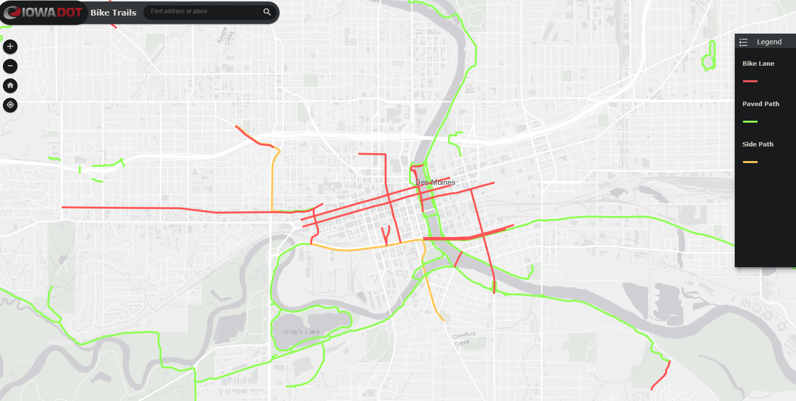

# Des Moines - Bike sharing Business Analysis

## Summary
This report analized data from the successuful bikesahring program from CitiBike in New york City for the month of August.

The report will make correlations to understand the viability of a bikesharing business in Des Moines, Iowa.

From the CitiBike analysis, five mains points will be considered when comparing the data:

- Population by Age
- Use by Age
- Population by Gender
- User type
- Time of day usage

Des Moines will be compared on one additional point: by tourist attractions.

It is important to note that there is no other city in the US that is like NYC, PRONTO. Howerver, there are interesting things to do in Des Moines.

## About Des Moines
Des Moines is the capital and most populous city of Iowa. 
The City of Des Moines, whice traces its start to 1843, is named for the Des Moines River, and it is located where the Des Moines and Raccoon Rivers meet.

With a 2020 population of 217,891, it is the largest city in Iowa and the 103rd largest city in the United States. Des Moines is currently growing at a rate of 0.24% annually and its population has increased by 7.11% since the most recent census

Humans have occupied Des Moines for at least 7,000 years, with many ancient occupation areas in present-day downtown Des Moines. There were also about 18 prehistoric American Indian mounds in the downtown area seen by early settlers, although all were destroyed.

(source from https://worldpopulationreview.com/us-cities/des-moines-ia-population)

## Analysis
The analysis will take information of the following dashboards:

[Link to NYC Dashboard](https://public.tableau.com/profile/giovanni.madalozzo#!/vizhome/bikesharing_15958255994130/NYCCitiBike?publish=yes)

[Link to Des Moines Dashboard](https://public.tableau.com/profile/giovanni.madalozzo#!/vizhome/bikesharing_15958255994130/DesMoines?publish=yes)

### Population by Age
The NYC data analysis shows that the most active age group is the one between 15 to 45 years old.

There were issues with this analysis, where a great number of entries with ages that are highly questionable. For example, there were people who registered with birth dates between 1880 and 1920. 

The report encourages people from all ages to be active, howerver for a business analysis all entries with birth date lower thatn 1945 were excluded.

The Des Moines dashboard shows that its population is well distributed and 45% falls between the 15 to 45 group. The average population age is 33.4.

### Use by Age
On the NYC dashboard the "Average Trip Duration" shows that the 15 to 45 group is the one that is most active and the one that take the bike for longer periods. Specially, people yonger than 25 years old.

### Population by Gender
Males are the main users of the CitiBike, with 65% of the total. Females are on the 25% range.

Des Moines has a population dominated by female individuals, with 52%, and males represent the other 48%.

From this analysis, a marketing campaing more focus to attract female individuals than males.

### User Type
The vast majority (81%) of the user of the CitiBike program is Subscribers. With means that, even in NYC almost all users can be considered local residents.
- The CitiBike is a program exclusive to NYC

Even that Des Moines visitors’ traffic is about 600,000 visitors per year. It is important for a business perpective to konw that most of the income is coming from the local residents.

(source: https://www.desmoinesregister.com/story/money/business/2017/12/13/think-no-one-vacations-des-moines-think-again/941870001/)

### Time of day Usage
On the NYC dashboard, the peak hours are between 7-9 AM and between 4-7 PM.

Des Moines can be considered the capital of the insurance industry with several companies with headquarter in the city. It is estimated that around 80,000 people move in and out of the city downtown every weekday.

This provides several opportinities to a bikesharing program in the city.

### Tourist Attractions
As mentioned before, the city brings about 600,000 visitors every year and a quick seach on TripAdvisor shows that the city is full of life with museums, landmarks, zoo, and parks.

It is important to notice that the city location. Its located right on the join of two major rivers. Looking close on Google Maps and you will see that the city has several bike trails that run on besides the rivers.

In fact, Des Moines has more that 800 miles of bike trials.
As you can see on the the picture below:

## Final Comments
Des Moines is a good candidate to have a bikesharing program. The city has a good number of visitors per year with good number of attractions and even a superb number of bike trails.

The city also has the right number of populations that fits the usual user of the CitiBike program in NYC.

